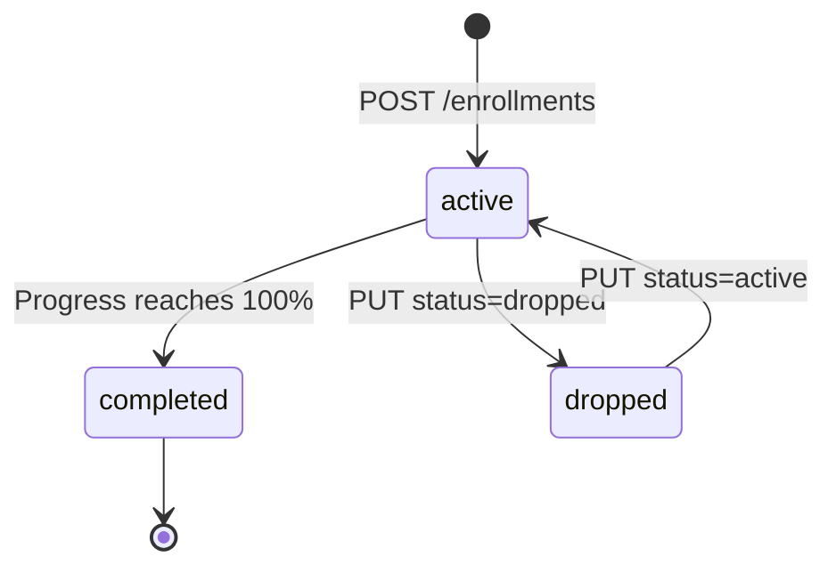

Enrollments represent the relationship between a user and a course. When a learner is enrolled, they gain access to the course content and can submit assessments. The API tracks progress and completion status throughout the learner's journey.

## Enrollment status transitions

<Note>
  Enrollments move through the following statuses. Direct transitions from `completed` back to `active` are not permitted — re-enrollment creates a new enrollment record instead.
</Note>



## The enrollment object

<ResponseField name="id" type="string" required>
  Unique identifier for the enrollment. Format: `enr_<alphanumeric>`.
</ResponseField>

<ResponseField name="user_id" type="string" required>
  The ID of the enrolled user.
</ResponseField>

<ResponseField name="course_id" type="string" required>
  The ID of the course the user is enrolled in.
</ResponseField>

<ResponseField name="status" type="string" required>
  Current enrollment status. One of `active`, `completed`, or `dropped`.
</ResponseField>

<ResponseField name="progress_percent" type="number" required>
  Completion progress from `0` to `100`. Automatically updated as the learner completes course modules.
</ResponseField>

<ResponseField name="enrolled_at" type="string" required>
  ISO 8601 timestamp of when the enrollment was created.
</ResponseField>

<ResponseField name="completed_at" type="string">
  ISO 8601 timestamp of when the enrollment status changed to `completed`. `null` if not yet completed.
</ResponseField>

---

## List enrollments

`GET /api/v1/enrollments`

Returns a paginated list of enrollments. Admins see all enrollments; learners only see their own.

### Query parameters

<ParamField query="user_id" type="string">
  Filter enrollments by a specific user ID.
</ParamField>

<ParamField query="course_id" type="string">
  Filter enrollments by a specific course ID.
</ParamField>

<ParamField query="status" type="string">
  Filter by enrollment status. One of `active`, `completed`, or `dropped`.
</ParamField>

<ParamField query="page" type="number" default="1">
  Page number to retrieve.
</ParamField>

<ParamField query="per_page" type="number" default="20">
  Number of enrollments per page. Maximum 100.
</ParamField>

### Example

<CodeGroup>

```bash cURL
curl "https://your-domain.com/api/v1/enrollments?user_id=usr_lrn001&status=active" \
  -H "Authorization: Bearer <access_token>"
```

```json response
{
  "data": [
    {
      "id": "enr_mn0456",
      "user_id": "usr_lrn001",
      "course_id": "crs_abc123",
      "status": "active",
      "progress_percent": 65,
      "enrolled_at": "2026-01-10T09:00:00Z",
      "completed_at": null
    },
    {
      "id": "enr_pq9012",
      "user_id": "usr_lrn001",
      "course_id": "crs_def456",
      "status": "active",
      "progress_percent": 20,
      "enrolled_at": "2026-02-14T14:30:00Z",
      "completed_at": null
    }
  ],
  "meta": {
    "total": 2,
    "page": 1,
    "per_page": 20
  },
  "error": null
}
```

</CodeGroup>

---

## Get an enrollment

`GET /api/v1/enrollments/:id`

Returns a single enrollment by its ID.

```bash
curl https://your-domain.com/api/v1/enrollments/enr_mn0456 \
  -H "Authorization: Bearer <access_token>"
```

---

## Create an enrollment

`POST /api/v1/enrollments`

Enrolls a user in a course. Admins can enroll any user. Learners can self-enroll in published courses.

### Request body

<ParamField body="user_id" type="string" required>
  The ID of the user to enroll.
</ParamField>

<ParamField body="course_id" type="string" required>
  The ID of the course to enroll the user in. Must be a published course.
</ParamField>

### Example

<CodeGroup>

```bash cURL
curl -X POST https://your-domain.com/api/v1/enrollments \
  -H "Authorization: Bearer <access_token>" \
  -H "Content-Type: application/json" \
  -d '{
    "user_id": "usr_lrn001",
    "course_id": "crs_ghi789"
  }'
```

```json response
{
  "data": {
    "id": "enr_rs3456",
    "user_id": "usr_lrn001",
    "course_id": "crs_ghi789",
    "status": "active",
    "progress_percent": 0,
    "enrolled_at": "2026-03-23T10:05:00Z",
    "completed_at": null
  },
  "meta": null,
  "error": null
}
```

</CodeGroup>

<Warning>
  If the user is already enrolled in the same course with `active` or `completed` status, the API returns a `422` error. Dropped enrollments can be reactivated via a `PUT` request instead.
</Warning>

---

## Update an enrollment

`PUT /api/v1/enrollments/:id`

Updates the status of an enrollment. Typically used to drop or reactivate an enrollment.

<ParamField body="status" type="string" required>
  New status for the enrollment. One of `active` or `dropped`. The `completed` status is set automatically by the system when progress reaches 100%.
</ParamField>

```bash
curl -X PUT https://your-domain.com/api/v1/enrollments/enr_mn0456 \
  -H "Authorization: Bearer <access_token>" \
  -H "Content-Type: application/json" \
  -d '{"status": "dropped"}'
```

---

## Delete an enrollment

`DELETE /api/v1/enrollments/:id`

Permanently removes an enrollment record. Requires the `admin` role.

<Warning>
  Deleting an enrollment also deletes all associated assessment submissions for that learner in that course. Use the `dropped` status to deactivate without losing data.
</Warning>

```bash
curl -X DELETE https://your-domain.com/api/v1/enrollments/enr_rs3456 \
  -H "Authorization: Bearer <access_token>"
```
