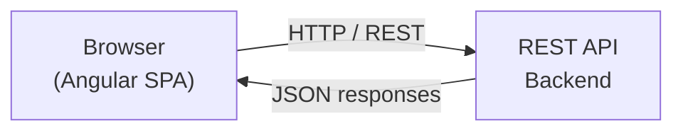

## High-level overview

Karma LMS (`gems-lms-web`) is a single-page application (SPA) built with Angular. The frontend communicates with a REST API backend over HTTP. The Angular app handles all routing, rendering, and state on the client side, while the backend is responsible for data persistence and business logic.



## Project structure

The project follows the standard Angular CLI directory layout:

```text
src/
├── app/
│   ├── app.module.ts
│   ├── app.component.ts
│   └── app-routing.module.ts
├── assets/
│   └── (images, fonts, static files)
└── environments/
    ├── environment.ts
    └── environment.prod.ts
dist/
    └── (compiled build output)
angular.json
package.json
```

| Directory | Purpose |
|---|---|
| `src/app/` | Main application module, components, services, and routing |
| `src/assets/` | Static files served as-is: images, fonts, icons |
| `src/environments/` | Environment-specific configuration (API URLs, feature flags) |
| `dist/` | Output directory produced by `ng build` — not committed to source control |

## Angular concepts

The application is built on standard Angular primitives:

<AccordionGroup>
  <Accordion title="Modules">
    Angular modules (`NgModule`) group related components, services, and routes. The root `AppModule` bootstraps the application, and feature modules encapsulate domain-specific functionality.
  </Accordion>

  <Accordion title="Components">
    Components are the building blocks of the UI. Each component consists of a TypeScript class, an HTML template, and optional styles. Angular CLI generates components with `ng generate component`.
  </Accordion>

  <Accordion title="Services">
    Services contain shared logic and data access. They are injected into components via Angular's dependency injection system. HTTP calls and state management live in services.
  </Accordion>

  <Accordion title="Routing">
    Angular Router maps URL paths to components. Lazy-loaded feature modules reduce the initial bundle size by loading routes on demand.
  </Accordion>

  <Accordion title="Reactive forms">
    Angular Reactive Forms provide a model-driven approach to handling form inputs, validation, and submission. Used throughout Karma LMS for learner enrollment, assessment authoring, and user management flows.
  </Accordion>
</AccordionGroup>

## Feature modules

The application is organized into feature modules aligned with LMS domain areas:

<CardGroup cols={2}>
  <Card title="Courses" icon="book">
    Course catalog, content authoring, and enrollment management.
  </Card>
  <Card title="Learners" icon="users">
    Learner profiles, progress tracking, and completion records.
  </Card>
  <Card title="Instructors" icon="chalkboard-teacher">
    Instructor dashboards, course assignments, and reporting.
  </Card>
  <Card title="Assessments" icon="clipboard-check">
    Quiz and assessment creation, delivery, and grading.
  </Card>
</CardGroup>

## HTTP communication

All API calls use Angular's built-in `HttpClient`, which is provided by `HttpClientModule`. Services inject `HttpClient` and return `Observable` streams that components subscribe to.

```typescript
import { HttpClient } from '@angular/common/http';
import { Observable } from 'rxjs';

@Injectable({ providedIn: 'root' })
export class CoursesService {
  constructor(private http: HttpClient) {}

  getCourses(): Observable<Course[]> {
    return this.http.get<Course[]>('/api/courses');
  }
}
```

## State management

Karma LMS uses Angular services combined with RxJS `BehaviorSubject` and `Observable` to manage shared state. This avoids an external state management library and keeps the dependency footprint small.

```typescript
import { BehaviorSubject, Observable } from 'rxjs';

@Injectable({ providedIn: 'root' })
export class AuthService {
  private currentUser$ = new BehaviorSubject<User | null>(null);

  getUser(): Observable<User | null> {
    return this.currentUser$.asObservable();
  }
}
```

<Note>
  Angular CLI handles code generation, build optimization (tree-shaking, minification, AOT compilation), and environment configuration. The `angular.json` file at the project root controls all CLI behavior, including build targets and asset paths.
</Note>
